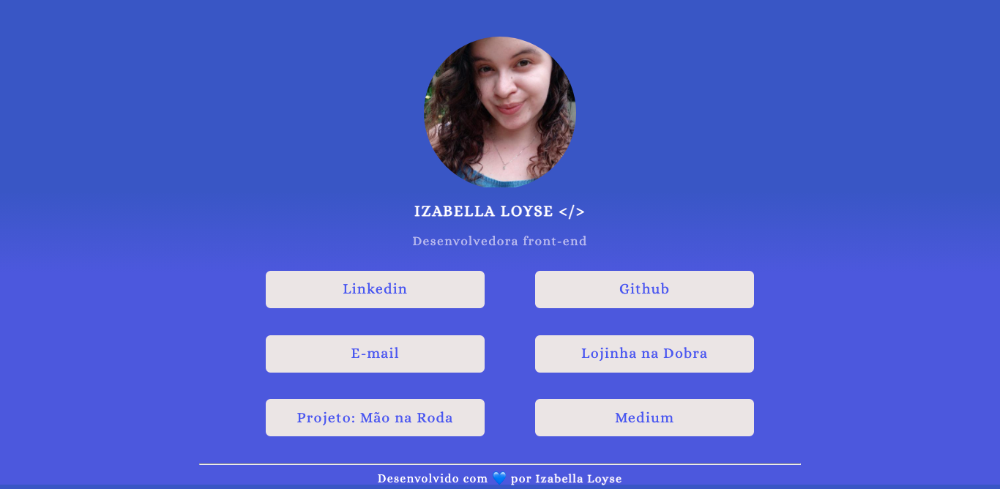

<h1 align="center"> Izabella Loyse </h1>

 

 &message=IzabellaLoyse&color=4859f0&style=for-the-badge&logo=">

<h2> 📌 Sobre o projeto <h2>

 
Página web contendo os links das minhas redes sociais e projetos.

 

<h2> 💻 Interface do projeto <h2>

 A interface do projeto pode ser visualizada no <a href="https://www.figma.com/file/eIBBWHAsI2QF6koATEqmsN/Testando-o-FIGMA?node-id=1202%3A2">Figma</a>. 

 

 
Acesse o site ;) <a href="https://izabellaloyse.tech/">Izabella Loyse</a>.

  

 

<h2> ⚙️ Tecnologias utilizadas </h2>
 
 
 ∙ HTML 
 ∙ CSS 
 ∙ SASS 
 

 

<h2>✨ Autor</h2>

  
 <b>Izabella Loyse Cândido</b>  
 Produzido e desenvolvido com amor por Izabella Loyse Cândido💙

